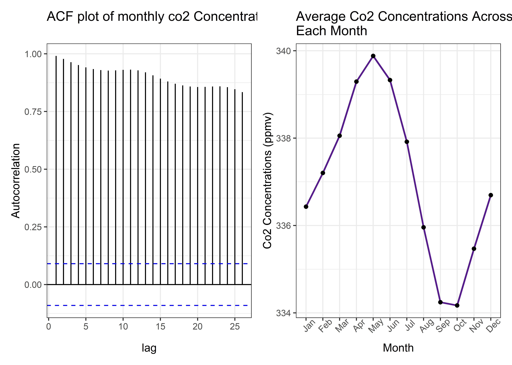
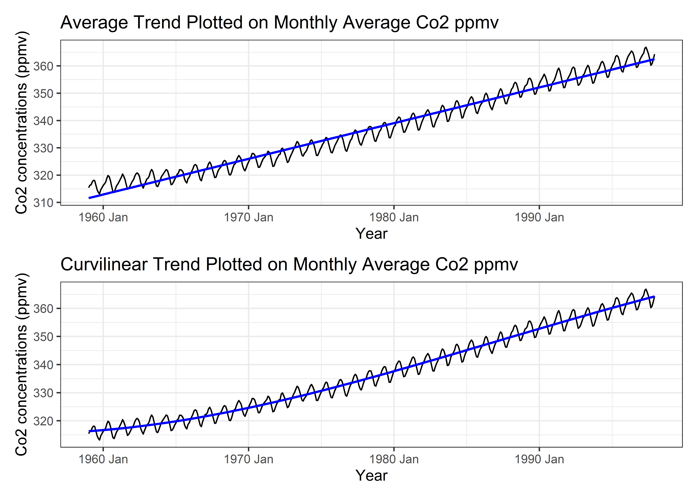

Statistical Methods for Discrete Response, Time Series, and Panel Data
(W271): Lab 2
================

# The Keeling Curve

In the 1950s, the geochemist Charles David Keeling observed a seasonal
pattern in the amount of carbon dioxide present in air samples collected
over the course of several years. He was able to attribute this pattern
to the variation in global rates of photosynthesis throughout the year,
caused by the difference in land area and vegetation cover between the
Earth’s northern and southern hemispheres.

In 1958 Keeling began continuous monitoring of atmospheric carbon
dioxide concentrations from the Mauna Loa Observatory in Hawaii and soon
observed a trend increase carbon dioxide levels in addition to the
seasonal cycle. He was able to attribute this trend increase to growth
in global rates of fossil fuel combustion. This trend has continued to
the present, and is known as the “Keeling Curve.”

<!-- -->

    ## # A tsibble: 468 x 2 [1M]
    ##       index value
    ##       <mth> <dbl>
    ##  1 1959 Jan  315.
    ##  2 1959 Feb  316.
    ##  3 1959 Mar  316.
    ##  4 1959 Apr  318.
    ##  5 1959 May  318.
    ##  6 1959 Jun  318 
    ##  7 1959 Jul  316.
    ##  8 1959 Aug  315.
    ##  9 1959 Sep  314.
    ## 10 1959 Oct  313.
    ## # ℹ 458 more rows

# Your Assignment

Your goal in this assignment is to produce a comprehensive analysis of
the Mona Loa CO2 data that you will be read by an interested,
supervising data scientist. Rather than this being a final report, you
might think of this as being a contribution to your laboratory. You and
your group have been initially charged with the task of investigating
the trends of global CO2, and told that if you find “anything
interesting” that the team may invest more resources into assessing the
question.

Because this is the scenario that you are responding to:

1.  Your writing needs to be clear, well-reasoned, and concise. Your
    peers will be reading this, and you have a reputation to maintain.
2.  Decisions that you make for your analysis need also be clear and
    well-reasoned. While the main narrative of your deliverable might
    only present the modeling choices that you determine are the most
    appropriate, there might exist supporting materials that examine
    what the consequences of other choices would be. As a concrete
    example, if you determine that a series is an AR(1) process your
    main analysis might provide the results of the critical test that
    led you to that determination and the results of the rest of the
    analysis under AR(1) modeling choices. However, in an appendix or
    separate document that is linked in your main report, you might show
    what a MA model would have meant for your results instead.
3.  Your code and repository are a part of the deliverable. If you were
    to make a clear argument that this is a question worth pursuing, but
    then when the team turned to continue the work they found a
    repository that was a jumble of coding idioms, version-ed or
    outdated files, and skeletons it would be a disappointment.

# Report from the Point of View of 1997

For the first part of this task, suspend reality for a short period of
time and conduct your analysis from the point of view of a data
scientist doing their work in the early months of 1998. Do this by using
data that is included in *every* R implementation, the `co2` dataset.
This dataset is lazily loaded with every R instance, and is stored in an
object called `co2`.

## (3 points) Task 0a: Introduction

Introduce the question to your audience. Suppose that they *could* be
interested in the question, but they don’t have a deep background in the
area. What is the question that you are addressing, why is it worth
addressing, and what are you going to find at the completion of your
analysis. Here are a few resource that you might use to start this
motivation.

- [Wikipedia](https://en.wikipedia.org/wiki/Keeling_Curve)
- [First Publication](./background/keeling_tellus_1960.pdf)
- [Autobiography of Keeling](./background/keeling_annual_review.pdf)

## (3 points) Task 1a: CO2 data

Conduct a comprehensive Exploratory Data Analysis on the `co2` series.
This should include (without being limited to) a [description of how,
where and why](https://gml.noaa.gov/ccgg/about/co2_measurements.html)
the data is generated, a thorough investigation of the trend, seasonal
and irregular elements. Trends both in levels and growth rates should be
discussed (consider expressing longer-run growth rates as annualized
averages).

What you report in the deliverable should not be your own process of
discovery, but rather a guided discussion that you have constructed so
that your audience can come to an understanding as succinctly and
successfully as possible. This means that figures should be thoughtfully
constructed and what you learn from them should be discussed in text; to
the extent that there is *any* raw output from your analysis, you should
intend for people to read and interpret it, and you should write your
own interpretation as well.

### Introduction

Co2 is classified as a “greenhouse gas,” which means that it traps heat
in the atmosphere and lead to rising global temperatures when in high
concentrations. It can be important to track Co2 levels as rising global
temperatures can lead to imbalances in ecosystems and rising water
levels that impact both animal and human life.

#### Description of data

The current data is gathered from measurements made at the Mauna Loa
Observatory in Hawaii (Cleaveland, 1993). Measurements were taken by a
chemical gas analyzer sensor, with detections based on infrared
absorption. This data measures monthly Co2 concentration levels from
January 1959 to December 1997. Units are in parts per million of CO2
(abbreviated as ppm) using the SIO manometric mole fraction scale. The
principal investigator responsible for the initial findings of trending
Co2 concentrations, Dr. Charles Keeling, initially designed a device to
detect Co2 concentrations to detect Co2 emitted from limestone near
bodies of water. But his measurements revealed a pattern of increasing
Co2 concentrations at the global scale, urging further need to continue
tracking the gas (Keeling, 1998).

### Exploratory Data Analysis

The time series shows a clear upward trend of global Co2 concentrations
from 1959 to 1998, with an average increase in 1.26 Co2 ppmv and a
standard deviation of .51 Co2 ppmv. Upon inspection of the yearly
increases, the bulk of changing Co2 levels are between 0.5 and 2.0 Co2
ppmv.

``` r
# monthly time series with the line of best fit

co2_trend_plot <- co2_tsib %>% 
  ggplot(aes(x = index, y = value)) +
  geom_line(color = 'black', size = .5) +
  geom_smooth(method = "lm", formula = "y ~ x",se = F, color = 'blue', size = .8) +
  labs(title = 'Average Trend Plotted on Monthly Average Co2 ppmv') +
  xlab('Year') +
  ylab('Co2 concentrations (ppmv)')
```

    ## Warning: Using `size` aesthetic for lines was deprecated in ggplot2 3.4.0.
    ## ℹ Please use `linewidth` instead.
    ## This warning is displayed once every 8 hours.
    ## Call `lifecycle::last_lifecycle_warnings()` to see where this warning was
    ## generated.

``` r
# average_yearly_increase
co2_tsib_yearly_change <- co2_tsib %>% as_tibble() %>% 
  mutate(year = year(index)) %>% 
  group_by(year) %>% 
  summarise(`yearly_co2` = mean(value)) %>% 
    ungroup() %>% 
    mutate(lag_co2 = lag(yearly_co2),
           change = yearly_co2 - lag_co2, 
           percent_change = ((yearly_co2 - lag_co2)/yearly_co2)*100)


# getting average increase (i.e. size of the trend)
yearly_mean <- mean(co2_tsib_yearly_change$change, na.rm = T) # average 1.26 units of co2 change each year
yearly_sd <- sd(co2_tsib_yearly_change$change, na.rm = T) # with a sd of .51 units of co2

change_hist <- ggplot(co2_tsib_yearly_change, aes(x = change)) + 
  geom_histogram(color = 'gray20', fill = 'gray', binwidth = .25) +
  scale_x_continuous(breaks = seq(floor(min(co2_tsib_yearly_change$change, na.rm =T)),
                                  ceiling(max(co2_tsib_yearly_change$change, na.rm =T)), by = 0.5)) +
  ggtitle('Histogram of Yearly changes in Co2 ppmv')
# bulk of increases yearly seem to be between .5 and 2 units on the 


co2_trend_plot / change_hist
```

    ## Warning: Removed 1 row containing non-finite outside the scale range
    ## (`stat_bin()`).

<!-- -->

The time series also shows string evidence of seasonality corresponding
closely with the meteorological season of autumn, winter, spring, and
summer. Autumn and Winter are seen to have higher Co2 concentrations
than in the spring and summer. This is likely due to the organic
decomposition of plant life in these seasons (Keeling, 1960). The
seasonality is evident in the consistent “peaks and valleys” in the
above monthly time series plot. Evidence is also found in the
Autocorrelation Function Plot below, where a scallop/wave shaped pattern
emerges among correlations between the current value with growing lags.
More clear evidence of seasonality is shown when inspecting the monthly
average the Co2 ppmv, when averaged across all years in the available
data (below).

``` r
# inspecting acf and graph of co2 concentrations over time

co2_acf <- acf(co2_tsib$value, plot = F)

co2_acf_plot <-  autoplot(co2_acf) + 
  labs(title = "ACF plot of monthly co2 Concentrations", x = 'lag', y = 'Autocorrelation')


monthly_co2_ave_plot <- co2_tsib %>% as_tibble() %>% 
  mutate(month = month(index)) %>% 
  group_by(month) %>% 
  summarise(co2_monthly_ave = mean(value, na.rm = T)) %>% 
  mutate(month_str = factor(month.abb[month], levels = month.abb)) %>% 
  ungroup() %>% 
  ggplot(aes(x = month_str, y = co2_monthly_ave, group = 1)) +
  geom_line(size = .8, color = 'purple4') +
  geom_point(size = 1.5) +
  ggtitle("Average Co2 Concentrations Across\nEach Month") +
  xlab('Month') +
  ylab('Co2 Concentrations (ppmv)')


co2_acf_plot | monthly_co2_ave_plot
```

<!-- -->

While there is a consistent positive yearly trend, some years have
differing variations across years, and differing magnitude of increasing
co2 concentrations within the year. This is somewhat evident when
fitting a yearly Co2 average on the monthly time series, and inspecting
the residuals from year to year. While slight, there seems to be
shifting variance of residuals. These irregularities however, regress to
a constant variance over time as is evident by a significant Augmented
Dickey–Fuller Test, suggesting stationarity. In particular, this
suggests to constant variance over time, as well as a non-moving average
once accounting for the yearly increases in co2 ppmv.

``` r
# making a plot to show how the relationship looks like with yearly averages over the seasons
yearly_ave_w_residuals <- co2_tsib %>% as_tibble() %>% 
  mutate(year = year(index)) %>% 
  group_by(year) %>% 
  mutate(`Yearly Co2` = mean(value)) %>%
  mutate(residual = value - `Yearly Co2`) %>%
  pivot_longer(cols = c(value, `Yearly Co2`, residual), names_to = "type", values_to = "Monthly Co2") %>% 
  mutate(residual_bool = if_else(type == "residual", "Residuals", "Monthly Time Series Plotted on Yearly Average Co2")) 


yearly_ave_w_residuals_plot <- yearly_ave_w_residuals %>% 
  ggplot(aes(x = index, y = `Monthly Co2`, color = type)) +
  geom_line() +
  facet_wrap(~residual_bool, scales = "free_y", ncol = 1) +
  xlab('Date') +
  theme(legend.position = "none")

# residuals of a simple yearly average look fairly stationary 
  # with some years having larger and smaller co2 variances 


adf_result <- yearly_ave_w_residuals %>% 
  filter(residual_bool == 'Residuals') %>%
  ungroup() %>% 
  pull(`Monthly Co2`) %>% 
  adf.test() 
```

    ## Warning in adf.test(.): p-value smaller than printed p-value

``` r
# Extract the relevant results into a data frame
adf_summary <- data.frame(
  Statistic = adf_result$statistic,
  P_Value = adf_result$p.value,
  Method = adf_result$method,
  Alternative = adf_result$alternative
)

kable(adf_summary, caption = "ADF Test Results")
```

|               | Statistic | P_Value | Method                       | Alternative |
|:--------------|----------:|--------:|:-----------------------------|:------------|
| Dickey-Fuller | -29.06892 |    0.01 | Augmented Dickey-Fuller Test | stationary  |

ADF Test Results

Variability in the yearly trend is also observed. While the average
change in Co2 ppmv is 1.26, this increase varies per year, with some
years experiencing heavier spikes in increasing Co2 concentrations than
others. Additionally, upon further inspection of the monthly average
trend plot above, the fitted line appears to be systematically
overestimating values at certain points and underestimating values at
other points. When fitting a curvilinear trend to the time series, we
see a closer fit the central Co2 ppmv for each year

``` r
# monthly time series with the curvilinear line of best fit

co2_curv_trend_plot <- 
  co2_tsib %>% 
  ggplot(aes(x = index, y = value)) +
  geom_line(color = 'black', size = .5) +
  geom_smooth(method = "lm", formula = "y ~ poly(x,3)",se = F, color = 'blue', size = .8) +
  labs(title = 'Curvilinear Trend Plotted on Monthly Average Co2 ppmv') +
  xlab('Year') +
  ylab('Co2 concentrations (ppmv)') 

co2_trend_plot / co2_curv_trend_plot
```

<!-- -->

3.  Irregularities
4.  While the yearly trend is consistent, some years have higher or
    lower variations within the year, which is evident from slightly
    differing variances on the residuals of fitting the yearly average
    Co2 ppmv with the monthly average Co2 ppmv.

<!-- -->

2.  However, while the variances shift slightly from year to year, the
    average variance is constant, as is evident by a significant result
    in the Augmented Dickey–Fuller Test of the residuals, suggesting
    stationarity in the residuals when fitted on the yearly average.
3.  Additionally, while the average trend is 1.26 Co2 ppmv, this
    increase varies per year, with some years experiencing heavier
    spikes in increasing Co2 concentrations than others.

## (3 points) Task 2a: Linear time trend model

Fit a linear time trend model to the `co2` series, and examine the
characteristics of the residuals. Compare this to a quadratic time trend
model. Discuss whether a logarithmic transformation of the data would be
appropriate. Fit a polynomial time trend model that incorporates
seasonal dummy variables, and use this model to generate forecasts to
the year 2020.

## (3 points) Task 3a: ARIMA times series model

Following all appropriate steps, choose an ARIMA model to fit to the
series. Discuss the characteristics of your model and how you selected
between alternative ARIMA specifications. Use your model (or models) to
generate forecasts to the year 2022.

## (3 points) Task 4a: Forecast atmospheric CO2 growth

Generate predictions for when atmospheric CO2 is expected to be at [420
ppm](https://research.noaa.gov/article/ArtMID/587/ArticleID/2764/Coronavirus-response-barely-slows-rising-carbon-dioxide)
and 500 ppm levels for the first and final times (consider prediction
intervals as well as point estimates in your answer). Generate a
prediction for atmospheric CO2 levels in the year 2100. How confident
are you that these will be accurate predictions?

# Report from the Point of View of the Present

One of the very interesting features of Keeling and colleagues’ research
is that they were able to evaluate, and re-evaluate the data as new
series of measurements were released. This permitted the evaluation of
previous models’ performance and a much more difficult question: If
their models’ predictions were “off” was this the result of a failure of
the model, or a change in the system?

## (1 point) Task 0b: Introduction

In this introduction, you can assume that your reader will have **just**
read your 1997 report. In this introduction, **very** briefly pose the
question that you are evaluating, and describe what (if anything) has
changed in the data generating process between 1997 and the present.

## (3 points) Task 1b: Create a modern data pipeline for Mona Loa CO2 data.

The most current data is provided by the United States’ National Oceanic
and Atmospheric Administration, on a data page
\[[here](https://gml.noaa.gov/ccgg/trends/data.html)\]. Gather the most
recent weekly data from this page. (A group that is interested in even
more data management might choose to work with the [hourly
data](https://gml.noaa.gov/aftp/data/trace_gases/co2/in-situ/surface/mlo/co2_mlo_surface-insitu_1_ccgg_HourlyData.txt).)

Create a data pipeline that starts by reading from the appropriate URL,
and ends by saving an object called `co2_present` that is a suitable
time series object.

Conduct the same EDA on this data. Describe how the Keeling Curve
evolved from 1997 to the present, noting where the series seems to be
following similar trends to the series that you “evaluated in 1997” and
where the series seems to be following different trends. This EDA can
use the same, or very similar tools and views as you provided in your
1997 report.

## (1 point) Task 2b: Compare linear model forecasts against realized CO2

Descriptively compare realized atmospheric CO2 levels to those predicted
by your forecast from a linear time model in 1997 (i.e. “Task 2a”). (You
do not need to run any formal tests for this task.)

## (1 point) Task 3b: Compare ARIMA models forecasts against realized CO2

Descriptively compare realized atmospheric CO2 levels to those predicted
by your forecast from the ARIMA model that you fitted in 1997
(i.e. “Task 3a”). Describe how the Keeling Curve evolved from 1997 to
the present.

## (3 points) Task 4b: Evaluate the performance of 1997 linear and ARIMA models

In 1997 you made predictions about the first time that CO2 would cross
420 ppm. How close were your models to the truth?

After reflecting on your performance on this threshold-prediction task,
continue to use the weekly data to generate a month-average series from
1997 to the present, and compare the overall forecasting performance of
your models from Parts 2a and 3b over the entire period. (You should
conduct formal tests for this task.)

## (4 points) Task 5b: Train best models on present data

Seasonally adjust the weekly NOAA data, and split both
seasonally-adjusted (SA) and non-seasonally-adjusted (NSA) series into
training and test sets, using the last two years of observations as the
test sets. For both SA and NSA series, fit ARIMA models using all
appropriate steps. Measure and discuss how your models perform in-sample
and (psuedo-) out-of-sample, comparing candidate models and explaining
your choice. In addition, fit a polynomial time-trend model to the
seasonally-adjusted series and compare its performance to that of your
ARIMA model.

## (3 points) Task Part 6b: How bad could it get?

With the non-seasonally adjusted data series, generate predictions for
when atmospheric CO2 is expected to be at 420 ppm and 500 ppm levels for
the first and final times (consider prediction intervals as well as
point estimates in your answer). Generate a prediction for atmospheric
CO2 levels in the year 2122. How confident are you that these will be
accurate predictions?
